# 천하결전 덱 시뮬레이터 v2 — 시스템 설계

> 상태: **v0.2 (2026-10-02) — P0~P4 1차 구현 완료**, 구현 현황은 아래 0-1절 · 기준 자료: `legacy/simulator-v1.12b.html`
> 용어: 한국판은 '병법'(전용 병법·세팅 병법)이다. 초안의 '병서' 표기는 모두 '병법'으로 고쳤다.
> 목표: 기존 단일 HTML(v1.12b)을 **데이터 / 전법 해석기 / 전투 엔진 / 웹 / MCP** 로 분리하고,
> 시즌별 데이터·버전 관리·전보(녹화) 기반 보정을 갖춘 소규모 배포용 웹 서비스로 만든다.

---

## 0. 현재 상태 진단 (v1.12b)

v1.12b는 한 파일(525KB) 안에 데이터·엔진·UI가 모두 들어 있다.

| 항목 | 현황 | 문제 |
|---|---|---|
| 장수 | 54명 (`GAME_DATA.generals`) | **시즌 구분 없음** |
| 전법 | 일반 77 + 고유 54 = 131개 | 효과가 `damage/heal/buffs/statMods…` 평면 배열이라 **트리거·조건·순서 표현이 약함** |
| 절(clause) 분해 | 474절 중 `ok` 274 · `NOTE` 125 · `MISSING` 69 · `special` 6 | **약 41%가 실제 계산에 반영 안 됨.** 특히 "(지력의 영향 받음)"이 `NOTE`로 버려져 스탯 계수가 빠짐 |
| 인연 | 50개 중 37개만 시뮬 가능 | 13개 미반영 |
| 병법 | 티어덱에 `"출사표 / 시리 / 탈계"` 문자열로만 존재 | **엔진 미반영** |
| 전투 엔진 | 포진→8턴, 선공순, 지휘→패시브→액티브(준비턴)→평타→추격 | 전법마다 `if` 분기(예: `selfRestrict`, `액티브재발동`)가 엔진에 하드코딩 → 전법 늘수록 엔진이 비대해짐 |
| 난수 | `Math.random()` | 같은 판을 **재현할 수 없음** → 전보와 1:1 비교 불가 |
| 보정 계수 | `DEFAULT_COEFFS` 코드 상수 | 계수 변경 이력·근거 추적 불가 |
| 저장 | `localStorage` | 기기 간 공유·배포 불가 |

`MISSING` 절 예시 — 이 유형들이 v2 효과 언어(DSL)의 요구사항이 된다:

- `턴마다 최대 10회 발동된다` → **발동 횟수 제한**
- `상대가 보유 중인 디버프 상태 1개당 책략 피해 계수가 15%→30% 증가 / 3회 증가할 수 있` → **개수 비례 + 상한**
- `축력 1스택 획득 … 모든 축력 스택수를 소모하여 추가 일반 공격` → **커스텀 스택 자원**
- `탈취한 통솔은 턴 종료 시 반환 / 탈취 효과는 매 턴 10% 감소` → **탈취 + 감쇠**
- `짐독 상태인 목표에게 피해를 준 후 25%→50% 확률로 짐독 부여` → **이벤트 트리거 + 조건 + 확률**
- `일반 공격의 50%→100% 피해 전달` → **직전 피해량 참조**

## 0-1. 구현 현황 (v0.2)

| 영역 | 상태 | 위치 |
|---|---|---|
| 한국판 DB 가져오기 | 완료 — 무장 67 · 전법 87 · 고유 67 · 인연 50 · 진형 8 · 티어덱 25 · 용어 62 · 이름사전 361 | `packages/data-tools/src/import-excel.ts` → `data/kr/` |
| v1.12b 효과 정의 연결 | 완료 — 131개 전법, 54 무장 | `import-legacy.ts` → `data/engine/` |
| 해외 자료(deck-lab) | 완료 — 출처 표기, 개인정보·이미지 제외 | `import-decklab.ts` → `data/reference/decklab/` |
| 해외 → 한국판 용어 | 완료 — 변환표 + 조사 보정 | `data/common/term-map.json`, `terms.ts` |
| 전투 엔진 | v1.12b 이식(원본과 전보 동일 검증) + 시드 난수 + 감사용 기록 + 버그 수정 3건 | `packages/engine/src/legacy/core.js` (`core-v1.12b.js` 는 고정본) |
| **규칙 감사** | 완료 — 정적 8종 + 동적 7종 + 엔진 공통 5종 | `packages/audit/` · 웹 '감사' 탭 · `pnpm audit` |
| 업데이트 게시판 | 완료 — 날짜·시즌·분류별 글, MCP 로 작성 | `data/changelog/` · 웹 '게시판' 탭 |
| 게임 정보 반영 | 완료 — 엑셀 위에 덮어쓰는 패치 층 | `data/patches/`, MCP `data_patch` |
| MCP 서버 | 완료 — 도구 14개, `.mcp.json` 등록 | `apps/mcp-server/` |
| 웹 | 완료 — 게시판·도감·티어덱·보유·시뮬·감사·해외 자료 | `apps/web/` |
| 덱 추천(1~5덱) | 미착수 (P6) | — |
| 효과 언어(AST) 엔진 | 미착수 — 현재는 v1.12b 효과 형식 | — |
| 병법 효과 | 미반영 — 전용 병법 원문만 있음, 세팅 병법 효과 자료 없음 | — |
| DB·배포(Supabase/Cloudflare) | 미착수 (P5) | — |

### 감사 시스템 요약

기준(오라클)은 엔진이 아니라 **한국판 원문과 용어 시트**다. 원문에서 기대 동작을 따로 뽑고(`expect.ts`), 감사 전투의 구조화 기록(trace)과 대조한다.

- **정적**: 엔진 정의 존재 · 유형 일치 · 발동 확률 일치 · 원문 수치 일치(밸런스 변경 감지) · 절 반영률 · 시점 해석 일치 · 한국판 용어 · 고유 전법 연결
- **동적**: 실전 발동 · 발동 단계(포진/턴 시작/행동/턴 종료/추격) · 특정 턴 조건 · 발동 확률 실측(이항 검정) · 원문 효과 실제 발생 · 대상 수 · 턴당 상한
- **엔진 공통**: 액티브 봉쇄 상태에서 액티브 금지 · 일반 공격 봉쇄 상태에서 공격 금지(용어 시트 정의에서 자동 추출) · 추격은 일반 공격 후에만 · 액티브 판정은 행동당 1회 · 전사한 무장은 행동 금지
- 감사 전투: 티어덱끼리 대전 + 티어덱에 없는 무장·전법은 티어덱에 끼워 넣은 대전 (기본 3,720판, 약 20초)
- 발견 → 수정 이력은 게시판(`data/changelog`)과 `ENGINE_FIXES`, `data/engine/overrides.json` 에 남긴다.

### 데이터 층 (아래가 위를 덮어쓴다)

```
data/kr/            엑셀 원본 (다시 가져오면 갱신)
data/engine/        v1.12b 효과 정의 (자동 변환)
data/engine/overrides.json   감사로 찾은 효과 정의 수정 (검수됨)
data/patches/       게임에서 확인한 정보 (MCP data_patch)
        ↓ build-bundle
apps/web/public/data/bundle.json
```

---

## 1. 전체 구조

```mermaid
flowchart LR
  subgraph Sources[원천 자료]
    XLS["엑셀 / 구글 시트<br/>(한국판 공식 텍스트)"]
    CNTW["중국·대만 위키/커뮤니티"]
    REC["전보 녹화 영상·스크린샷"]
  end

  subgraph Repo[GitHub 저장소 = 원본(Source of Truth)]
    DATA["data/<br/>시즌별 JSON"]
    PARSER["packages/parser<br/>문장→절→효과 AST"]
    ENGINE["packages/engine<br/>전투 엔진(TS)"]
    MCP["apps/mcp-server"]
    WEB["apps/web"]
    TESTS["tests/golden<br/>전보 회귀 테스트"]
  end

  subgraph Cloud[무료 클라우드]
    DB[("Supabase Postgres<br/>+ Auth + Storage")]
    HOST["Cloudflare Pages<br/>웹 호스팅"]
  end

  Claude(("Claude<br/>Code / Desktop / claude.ai"))

  XLS --> MCP
  CNTW --> MCP
  REC --> MCP
  Claude <--MCP 프로토콜--> MCP
  MCP --> DATA
  DATA --> PARSER --> ENGINE
  ENGINE --> WEB
  TESTS --> ENGINE
  Repo --GitHub Actions 배포--> DB
  Repo --GitHub Actions 배포--> HOST
  WEB <--> DB
```

핵심 원칙:

1. **게임 데이터는 Git이 원본**, DB는 배포본. 데이터 변경도 코드처럼 PR·리뷰·되돌리기가 가능해야 한다.
2. **엔진은 순수 함수 + 시드 난수.** 같은 (덱, 데이터버전, 엔진버전, 보정버전, 시드) → 항상 같은 결과.
3. **전법 효과는 코드가 아니라 데이터(AST).** 엔진은 AST 해석기이고, 새 전법은 AST만 추가한다.
4. **모든 절은 추적 가능.** 원문의 각 절 → 어떤 AST 노드로 구현됐는지(또는 왜 무시했는지) 1:1 연결.
5. **사용자 데이터(보유·내 덱·전보)는 DB**, 게임 데이터(장수·전법·티어덱)는 Git → DB 단방향.

---

## 2. 저장소 구성 (모노레포)

```
Leo/
├─ data/                        # 게임 데이터 (원본)
│  ├─ common/                   # 시즌 무관: 상태이상 정의, 병종 상성, 진형, 용어집
│  │  ├─ statuses.json
│  │  ├─ formations.json
│  │  ├─ unit-types.json
│  │  └─ glossary.ko-zh.json    # 한국어 ↔ 简体/繁體 용어 매핑
│  ├─ seasons/
│  │  ├─ S1/
│  │  │  ├─ season.json         # 시즌 메타(기간, 신규 장수/전법 목록, 밸런스 패치 노트)
│  │  │  ├─ generals.json
│  │  │  ├─ skills.json         # 일반 전법 + 고유 전법 (원문 + 절 + AST)
│  │  │  ├─ tactics.json        # 병법
│  │  │  ├─ bonds.json          # 인연
│  │  │  └─ tier-decks.json
│  │  └─ S2/ …                  # 이전 시즌 대비 "패치(덮어쓰기)"만 둘 수도 있음 (§4.2)
│  ├─ calibration/
│  │  └─ coeffs-2026.10.02.json # 데미지 공식 계수 (버전별 파일)
│  └─ overrides/                # 사람이 검수한 절→AST 수동 매핑
├─ schemas/                     # JSON Schema (데이터 검증·MCP 입력 검증 공용)
├─ packages/
│  ├─ parser/                   # 한국어 전법 문장 → 절 → AST 컴파일러
│  ├─ engine/                   # 전투 엔진 (브라우저·Node 공용, 의존성 0)
│  ├─ recommender/              # 보유 기반 1~5덱 추천
│  └─ report/                   # 전보 이벤트 로그 스키마·비교(보정) 로직
├─ apps/
│  ├─ web/                      # Vite + TypeScript (+ 경량 UI 프레임워크)
│  └─ mcp-server/               # Claude 연결용 MCP 서버
├─ tests/
│  ├─ golden/                   # 실제 전보로 만든 회귀 테스트 케이스
│  └─ parser-fixtures/
├─ supabase/migrations/         # DB 스키마 SQL
├─ legacy/simulator-v1.12b.html # 기존 버전 (참고·비교용 보존)
├─ .mcp.json                    # Claude Code 프로젝트용 MCP 등록
└─ docs/
```

기술 선택 이유:

- **TypeScript**: v1.12b 엔진이 JS라 이식 비용이 가장 낮고, 엔진을 웹(Web Worker)·MCP 서버(Node)·CI 테스트에서 **같은 코드로** 돌릴 수 있다.
- **Supabase 무료 플랜**: Postgres + 로그인(초대 전용 가능) + 파일 저장 + 행 단위 권한(RLS)이 한 번에 해결된다. 소수 유저 규모에 충분.
  - 주의: 무료 플랜은 1주일 무활동 시 일시정지 → GitHub Actions로 주 1회 핑, 또는 사용자가 있으면 문제 없음.
  - 저장 용량 1GB → **원본 녹화 영상은 저장하지 않는다**(§8).
- **Cloudflare Pages**: 정적 웹 무료 호스팅, 커스텀 도메인·접근 제한(Cloudflare Access) 가능.

---

## 3. 데이터 모델

### 3.1 게임 데이터 (Git → DB 배포)

```ts
// 장수
interface General {
  id: string;               // 영구 ID. 이름이 바뀌어도 불변. 예: "gen.liubei"
  name: { ko: string; zhCN?: string; zhTW?: string };
  gender: 'M' | 'F';
  faction: '위' | '촉' | '오' | '군웅' | string;
  unitType: '방패병' | '궁병' | '창병' | '기병' | string;
  position: '전열' | '균형' | '후열';
  role?: string;
  stats: { 무력: number; 지력: number; 통솔: number; 선공: number }; // 만렙 기준
  growth?: Partial<Record<StatKey, number>>;   // 레벨당 성장치(자료 있으면)
  maxTroops: number;
  uniqueSkillId: string;
  introducedSeason: string; // "S1"
  sources: SourceRef[];     // 어디서 온 데이터인지 (§7)
}

// 전법 (일반·고유 공통)
interface Skill {
  id: string;                         // "skill.dan-jeok-ryang-do"
  name: { ko: string; zhCN?: string; zhTW?: string };
  kind: '지휘' | '패시브' | '액티브' | '추격';
  trait?: '병기' | '책략' | '치유' | string;
  grade?: '전설' | '영웅' | string;
  isUnique: boolean;
  ownerGeneralId?: string;            // 고유 전법이면 소유 장수
  procRate: { min: number; max: number }; // 1레벨→최대레벨
  prepTurns?: number;
  text: { ko: string; zhCN?: string; zhTW?: string }; // 원문
  textHash: string;                   // 원문 해시 — 문장이 바뀌면 AST 재검수 대상
  clauses: Clause[];                  // §5
  program: EffectNode[];              // 컴파일된 AST (엔진이 실행하는 것)
  coverage: { ok: number; ignored: number; missing: number };
  introducedSeason: string;
  sources: SourceRef[];
}

interface Tactic {          // 병법
  id: string; name: {...}; category?: string;
  text: {...}; clauses: Clause[]; program: EffectNode[];
}

interface Bond {            // 인연
  id: string; name: {...}; requiredCount: number; memberIds: string[];
  text: {...}; clauses: Clause[]; program: EffectNode[];
}

interface TierDeck {
  id: string; season: string; tier: 'T0+' | 'T0' | 'T1' | 'T2' | string;
  name: string; formationId?: string;
  units: Array<{
    generalId: string;
    skillIds: [string, string];
    tacticIds: string[];            // 병법 (문자열 → ID로 정규화)
    statAllocation: Partial<Record<StatKey, number>> | { priority: StatKey[] };
  }>;
  note?: string; sourceUrl?: string; updatedAt: string;
}
```

> 병법·인연·진형·병종·진영 보너스도 **전법과 똑같이 `clauses → program`** 을 갖는다.
> 엔진 입장에서는 "전투 시작 시 등록되는 효과 프로그램"일 뿐이라 한 해석기로 처리된다.

### 3.2 사용자 데이터 (Supabase)

| 테이블 | 주요 컬럼 | 설명 |
|---|---|---|
| `profiles` | id, nickname, role(`admin`/`member`) | 초대된 유저만 |
| `roster_generals` | user_id, general_id, level, stars/돌파, stat_points, owned | 보유 장수 |
| `roster_skills` | user_id, skill_id, level, count | 보유 전법(같은 전법 여러 장 가능 시 count) |
| `roster_tactics` | user_id, tactic_id, level | 보유 병법 |
| `decks` | id, user_id, season, name, payload(json), source(`manual`/`recommend`/`tier`) | 내가 만든/추천받은 덱 |
| `sim_runs` | id, user_id, deck_a, deck_b, runs, seed, **data_version, engine_version, calib_version**, result(json) | 재현 가능한 시뮬 결과 |
| `battle_reports` | id, user_id, season, decks(json), events(json), media_refs, status(`raw`/`parsed`/`verified`), notes | 전보 |
| `calibration_findings` | report_id, event_idx, expected, simulated, error, category | 전보 vs 시뮬 차이 |
| `data_releases` | version, season, published_at, manifest(json), bundle_url | Git에서 배포된 게임 데이터 버전 |

모든 사용자 테이블은 RLS로 `user_id = auth.uid()`만 읽기/쓰기. 전보와 보정 결과는 `admin`이 전체 열람.

---

## 4. 시즌 & 버전 관리

### 4.1 세 가지 버전 축

| 축 | 형식 | 바뀌는 때 | 저장 위치 |
|---|---|---|---|
| **데이터 버전** | `S5.2026-10-02.r3` | 장수·전법·티어덱·번역 수정 | Git `data/` → `data_releases` |
| **엔진 버전** | SemVer `2.3.1` | 전투 규칙/해석기 수정 | `packages/engine/package.json`, Git 태그 `engine-v2.3.1` |
| **보정 버전** | `calib-2026.10.02` | 데미지 공식 계수 재추정 | `data/calibration/*.json` |

모든 시뮬 결과(`sim_runs`)에 세 버전 + 시드를 기록 → "지난주 결과와 왜 다르지?"를 항상 추적할 수 있다.
웹 UI에는 현재 버전을 상단에 표시하고, 이전 버전으로 고정(pin)해서 비교 시뮬도 가능하게 한다.

### 4.2 시즌 데이터 방식: 기준 + 패치

- `S1`은 전체 데이터, 이후 시즌은 **추가/변경분만** 기록(`season.json`의 `patches`).
- 빌드 시 `S1 + S2패치 + … + Sn패치` → 시즌 `Sn`의 완성 번들(`bundle-S5.json`) 생성.
- 덕분에 "S3에서 이 전법 계수가 어떻게 바뀌었나"가 diff로 바로 보인다.
- 시즌별 장수/전법 목록 화면 = 해당 시즌 번들 + `introducedSeason` 필터.

### 4.3 업데이트 흐름 (데이터 수정이 서비스에 반영되기까지)

```mermaid
sequenceDiagram
  participant U as 사용자
  participant C as Claude (MCP)
  participant G as GitHub (브랜치/PR)
  participant CI as GitHub Actions
  participant DB as Supabase
  participant W as 웹

  U->>C: "S5 시트 업데이트했어, 반영해줘"
  C->>C: import_sheet → 정규화 → 절 분해/AST 컴파일
  C->>C: validate + coverage + 골든 전보 회귀 테스트
  C-->>U: 변경 요약(diff), 미해결 절 목록, 정확도 변화 보고
  U->>C: 승인 / 미해결 절 수정 지시
  C->>G: 커밋 & PR
  G->>CI: 스키마검증 · 파서 테스트 · 엔진 테스트 · 골든 전보 오차 체크
  CI-->>G: 통과 시 머지 가능
  G->>CI: main 머지
  CI->>DB: data_releases에 새 번들 업로드
  CI->>W: 웹 재배포
  W->>DB: 최신(또는 고정된) 데이터 버전 로드
```



**CI 품질 게이트 (머지 차단 조건)**

1. JSON Schema 위반
2. 원문이 바뀌었는데(`textHash` 변경) 검수되지 않은 AST
3. 커버리지 하락 (`missing` 절 증가)
4. 골든 전보 회귀: 이벤트별 피해량 평균 오차가 기준(예: 5%) 초과 또는 이전 대비 악화
5. 엔진 결정성: 같은 시드 두 번 실행 결과 불일치

---

## 5. 전법 문장 → 절 → 효과 AST (가장 중요)

### 5.1 파이프라인

```
원문 ─▶ ① 정규화 ─▶ ② 절 분해 ─▶ ③ 패턴 매칭 ─▶ ④ AST 조립 ─▶ ⑤ 검증·커버리지
                                    │ 실패
                                    ▼
                         ⑥ Claude 제안(MCP) ─▶ 사람 승인 ─▶ overrides/ 저장
```

① **정규화**
- `55%→110%` → `{min:0.55, max:1.10}` (전법 레벨 1→10 보간)
- `50%→100%~70%→140%` → 범위 랜덤의 하한/상한 각각 레벨 보간
- `을(를)`, `이(가)` 등 조사 통일, 오탈자 사전(`지력이 영향 받음` → `지력의 영향 받음`)
- 상태명 표준화 (`무장해제` ↔ `무장 해제`)

② **절 분해** — 기준: *트리거 / 조건 / 대상 / 동작 / 수치 / 지속 / 제한*
- 문장 경계: `.`
- 트리거 경계: `전투 시작 시,` `매 턴 종료 시,` `~한 후,` `~시전하기 전`
- 병렬 동작: `~하며`, `~하고`, `추가로`, `또한`
- **괄호는 버리지 않고 직전 절의 수식어로 붙인다** — `(지력의 영향 받음)` → `scaling: 지력`, `(무장 해제 상태 무시)` → `ignore: [무장 해제]`, `(최대 10스택)` → `maxStacks: 10`
- v1.12b에서 `NOTE` 처리된 125절 대부분이 이 규칙으로 흡수된다.

③ **패턴 라이브러리** — 한국어 템플릿 → AST 조각. 예:

| 패턴 | 결과 |
|---|---|
| `{대상}에게 {수치}의 {병기\|책략} 피해를 준다` | `Damage{type, coeff, target}` |
| `{N}턴 동안 지속되는 {상태}을 부여` | `ApplyStatus{status, duration:N}` |
| `{대상}의 {스탯}이 {수치}포인트 증가` | `ModifyStat{stat, flat}` |
| `{X} 1개당 … {수치} 증가` + `{K}회 증가할 수 있` | `ScaleBy{count:X, per, cap:K}` |
| `매 턴 최대 {N}회 발동` | `Limit{perTurn:N}` |
| `{수치} 확률로` | `Chance{p}` |
| `{상태}를 보유한 경우` / `목표가 전열이면` | `If{cond}` |

④ **AST (효과 언어) 설계** — 엔진이 실행하는 유일한 형식

```ts
type EffectNode =
  | { on: Trigger; when?: Cond; chance?: Num; limit?: Limit; do: Action[] }

type Trigger =
  | 'battleStart' | 'turnStart' | 'turnEnd' | 'beforeAction' | 'onAction'   // 지휘/패시브/액티브 슬롯
  | 'afterBasicAttack' | 'onPursuit'
  | { event: 'afterDealDamage' | 'afterTakeDamage' | 'afterHeal' | 'afterApplyDebuff'
             | 'afterActiveSuccess' | 'onStatusGained' | 'onDeath';
      who: Who; filter?: { dmgType?: '병기'|'책략'; source?: 'basic'|'active'|'pursuit' } }
  | { turns: number[] | { from: number } };                                    // 3번째 턴부터 등

type Action =
  | { Damage: { type: '병기'|'책략'; coeff: Num; target: Target; tags?: string[] } }
  | { DamageTransfer: { ratioOfLast: Num; target: Target } }
  | { Heal: { coeff: Num; target: Target } }
  | { ModifyStat: { stat: StatKey; flat?: Num; pct?: Num; target: Target; duration?: number; scaling?: StatKey } }
  | { ModifyRate: { key: RateKey; value: Num; target: Target; duration?: number } } // 주는피해, 받는추격피해, 회심…
  | { ApplyStatus: { status: string; target: Target; duration: number; stacks?: number } }
  | { Dispel: { target: Target; count: number; kind: 'debuff'|'buff' } }
  | { GainResource: { name: string; amount: number; max?: number } }          // 축력, 결사, 다짐…
  | { ConsumeResource: { name: string; all?: boolean; then: Action[] } }
  | { Steal: { stat: StatKey; amount: Num; returnAt: 'turnEnd'; decayPerTurn?: number } }
  | { ExtraBasicAttack: { times: Num; ignore?: string[] } }
  | { RecastSkill: { chance: Num; noPrep: boolean } }
  | { SelfRestrict: { noBasicOn?: 'odd'|'even'; noActiveOn?: 'odd'|'even' } }
  | { If: { cond: Cond; then: Action[]; else?: Action[] } };

type Num = number | { min: number; max: number }                      // 레벨 보간
         | { base: Num; scaling: StatKey; perPoint?: number }         // "지력의 영향 받음"
         | { per: Countable; each: Num; cap?: number };                // "디버프 1개당 15%, 최대 3회"

type Target = 'self' | 'allAllies' | 'allEnemies' | { pick: 'random'|'lowestHp'|'highestStat';
              side: 'ally'|'enemy'; n: number; stat?: StatKey; preferRow?: 'front'|'back'; excludeSelf?: boolean }
              | 'attackTarget' | 'eventSource' | 'eventTarget';
```

예) `보급 차단` 원문
> 턴 시작 시 적군 단일 목표에게 2턴 동안 지속되는 군량 고갈을 부여한다. 턴 종료 시 군량 고갈 상태를 보유한 적군에게 55%→110%의 책략 피해를 준다.

```json
[
  { "on": "turnStart", "do": [
    { "ApplyStatus": { "status": "군량 고갈", "duration": 2,
                       "target": { "pick": "random", "side": "enemy", "n": 1 } } } ] },
  { "on": "turnEnd", "do": [
    { "Damage": { "type": "책략", "coeff": { "min": 0.55, "max": 1.10 },
                  "target": { "pick": "all", "side": "enemy",
                              "where": { "hasStatus": "군량 고갈" } } } } ] }
]
```

⑤ **절 ↔ AST 추적표** (`clauses` 필드)

```json
{ "idx": 1, "text": "턴 종료 시 군량 고갈 상태를 보유한 적군에게 55%→110%의 책략 피해를 준다",
  "role": ["trigger", "cond", "target", "action"],
  "impl": ["program[1]"], "status": "ok", "by": "pattern:damage.v3", "reviewed": true }
```

- `status`: `ok` / `ignored`(사유 필수: "연출 문구" 등) / `missing` / `approx`(근사 구현, 사유 필수)
- 웹에 **"전법 커버리지" 화면**: 전법별 원문 절에 색을 칠해(초록=반영, 노랑=근사, 빨강=미반영) 바로 보이게 한다.

⑥ **패턴으로 안 풀리는 절** → MCP 도구 `skill_propose_ast`로 Claude가 AST를 제안 → JSON Schema 검증 → 사용자가 웹/대화에서 승인 → `data/overrides/`에 원문 해시와 함께 저장. 원문이 바뀌면 오버라이드는 자동 무효화되어 재검수 대상이 된다.

### 5.2 엔진 = AST 해석기

- 엔진은 이벤트 버스 구조: 모든 피해·회복·상태 부여가 이벤트를 발행하고, 등록된 `EffectNode`의 트리거가 반응한다.
- **전법별 하드코딩 금지.** v1.12b의 `selfRestrict`, `액티브재발동`, `용담 7회` 같은 특수 처리는 전부 AST 액션(`SelfRestrict`, `RecastSkill`, `Limit`)으로 옮긴다.
- 무한 연쇄 방지: 이벤트 깊이 제한 + `Limit{perTurn, perBattle}`.
- 진행 순서(v1.12b 검증 결과 계승, 전보로 계속 검증):
  1. **포진**: 진영/병종/진형/인연/병법 효과 등록 → `battleStart` 지휘·패시브(선공 순)
  2. **턴 1~8**: `turnStart` → 선공 순(차이 70 초과 시 확정 우선, 그 외 확률) 행동
     - 행동: 상태 판정(공포·혼란·침묵…) → 준비 완료 액티브 → 액티브(확률·준비턴) → 일반 공격 → 추격
  3. `turnEnd` → 지속시간 감소(보유자 기준/턴 기준 — 보정 항목) → 승패 판정
- **시드 난수(PRNG)** 를 쓰고, 난수가 쓰인 지점(발동 판정, 대상 선택, 회심…)을 라벨링해 기록 → 전보 재현 모드(§8.3)에서 "실제로 일어난 결과"를 강제 주입할 수 있다.
- 데미지 공식 계수(`Clin, kDef, C, beta …`)는 `calibration/*.json`에서 읽는다(코드 상수 아님).
- 계정 변수(공급·건물 기술·장비·전법 승급 등)는 v1.12b와 같이 기본 미반영이되, **덱 입력에 선택 항목으로** 둘 수 있게 스키마에 자리만 마련한다.

---

## 6. MCP 연결 설계

### 6.1 연결 방식 (단계별)

| 단계 | 방식 | 누가 쓰나 | 설정 |
|---|---|---|---|
| **A. 지금** | 로컬 stdio MCP 서버 (`apps/mcp-server`) | 관리자(본인) — Claude Code / Claude Desktop | 저장소의 `.mcp.json`에 등록 → 저장소를 열면 자동 연결 |
| **B. 배포 후** | 원격 MCP 서버(Streamable HTTP) — Cloudflare Workers 또는 Supabase Edge Function, OAuth 인증 | 본인 + 필요 시 운영 보조자 | claude.ai **설정 → 커넥터 → 커스텀 커넥터**에 URL 등록 |
| 보조 | 기존 **Google Drive 커넥터** | 구글 시트 원본 읽기 | 이미 이 세션에 연결 가능 |

A 단계에서 MCP 서버는 Git 작업 트리의 `data/`를 직접 읽고 쓰며(→ 변경은 PR로), Supabase에는 **읽기 + 전보/보정 테이블 쓰기**만 한다. 게임 데이터의 DB 반영은 항상 CI가 한다(사람·Claude가 DB를 직접 고치지 않음).

### 6.2 MCP 도구 목록

| 그룹 | 도구 | 하는 일 |
|---|---|---|
| 데이터 | `data_import_sheet(source, season)` | 엑셀/구글시트 → 정규화 JSON, 변경 diff 반환 |
| | `data_get(entity, id\|query, season)` | 장수/전법/병법/인연/티어덱 조회 |
| | `data_diff(fromVersion, toVersion)` | 시즌·버전 간 변경점 |
| | `data_validate()` | 스키마 + 커버리지 + 골든 회귀 실행 |
| 전법 해석 | `skill_parse(text)` | 원문 → 절 + AST + 미해결 절 |
| | `skill_coverage(season?)` | 미반영 절 목록(우선순위: 티어덱 사용 빈도순) |
| | `skill_propose_ast(skillId, clauseIdx, ast)` | Claude가 만든 AST 제안 등록(검증 후 승인 대기) |
| 번역 | `source_fetch(url)` / `translate_entity(zhText, kind)` | 중·대만 자료 수집 및 용어집 기반 번역 → 검수 대기 |
| 티어덱 | `tierdeck_upsert(season, deck)` | 티어덱 추가/수정 |
| 보유 | `roster_get(userId)` / `roster_update(...)` | 보유 장수·전법 |
| 추천 | `deck_recommend(userId, season, count=5)` | 보유 기반 1~5덱 추천 (§9) |
| 시뮬 | `sim_run(deckA, deckB, runs, seed?)` | 몬테카를로 결과 + 대표 전보 로그 |
| | `sim_matrix(decks[], opponents[])` | 다대다 승률표 |
| 전보 | `report_ingest(media|frames|text)` | 전보 → 이벤트 로그 JSON (§8) |
| | `report_replay(reportId)` | 전보 강제 재현 → 이벤트별 오차 |
| | `calibrate(reportIds[])` | 계수 재추정 제안 + 규칙 불일치 목록 |
| 버전 | `release_prepare()` | 변경 요약 + 브랜치 커밋 + PR 생성 |

MCP 리소스(읽기 전용): `game://seasons/{S}/bundle`, `game://glossary`, `game://coverage`, `game://calibration/current`.

---

## 7. 외부 자료(중국·대만) 수집·번역

1. **원천 등록**: 사이트별 출처 목록을 `data/sources.json`에 관리(사이트, 언어, 신뢰도, 마지막 수집일).
   (원작은 중국판 「三国：谋定天下」/ 대만판 「三國：謀定天下」로 보이며 — 확인 필요 — 해당 위키·공략 커뮤니티를 대상으로 한다.)
2. **매칭**: 한국어명 ≠ 직역(예: `보급 차단` = `斷敵糧道`)이므로 `name.zhCN/zhTW` 매핑 테이블을 먼저 만든다. v1.12b의 `nameOrig` 필드가 출발점.
3. **번역**: `glossary.ko-zh.json`(戰法→전법, 兵書→병법, 緣分→인연, 先攻→선공, 統率→통솔 …)을 강제 적용하고, **한국판 문장 패턴에 맞춘 템플릿 번역**으로 출력 → 같은 파서로 해석 가능하게.
4. **우선순위 규칙**: 한국판 공식 텍스트(사용자 시트) > 한국 커뮤니티 > 대만(번체) > 중국(간체). 번역 데이터는 `sources[].lang`, `confidence`, `koVerified:false`로 표시하고 UI에 "번역 데이터" 배지.
5. **수치 차이**: 서버별 밸런스가 다를 수 있으므로 중·대만 수치는 한국판 값이 없을 때만 사용하고, 충돌 시 `conflicts` 목록으로 보고.
6. 수집은 소량·수동 트리거·출처 표기 원칙(로봇 배제 규칙 준수).

---

## 8. 전보 녹화 → 시뮬 개선

### 8.1 수집

- 사용자가 웹에서 녹화 영상 또는 스크린샷 업로드.
- **원본 영상은 저장하지 않는다.** 브라우저에서 (또는 MCP 쪽 `ffmpeg`로) 장면 전환 프레임만 추출 → 전보 텍스트가 보이는 프레임만 남김 → 압축 이미지로 Storage 저장 (영상 원본은 유튜브 비공개 링크나 구글 드라이브 링크로 `media_refs`에 참조만).

### 8.2 구조화 (Claude 비전)

`report_ingest`가 프레임을 Claude에게 읽혀 아래 이벤트 로그로 변환:

```json
{ "turn": 2, "seq": 14, "actor": "제갈량", "kind": "skill_cast", "skill": "충신의 기재",
  "target": "여포", "value": { "damage": 1832, "dmgType": "책략", "crit": false },
  "troopsAfter": { "여포": 6120 }, "raw": "[제갈량]이(가) …" }
```

- 덱 정보(장수·전법·병법·스탯 배분·병력)도 함께 기록 — 없으면 재현 불가이므로 업로드 폼 필수 항목.
- 사람이 웹에서 인식 결과를 검수 → `status: verified`.

### 8.3 활용 (보정 루프)

1. **강제 재현(replay)**: 같은 덱으로 엔진을 돌리되, 전보에 나온 확률 결과(발동 여부·대상·회심)를 시드 대신 주입 → 이벤트 단위 1:1 비교.
2. **오차 분류**
   - *수치 오차*: 순서·대상은 같은데 피해량만 다름 → 계수 문제 → `calibrate`가 최소제곱으로 `Clin, kDef, C, beta…` 재추정, 새 `calibration/*.json` 제안.
   - *규칙 오차*: 발동 순서·횟수·대상이 다름 → 엔진 규칙 또는 AST 오류 → `calibration_findings`에 이슈로 쌓고, 해당 전법의 절을 지목.
3. **골든 테스트화**: 검수된 전보는 `tests/golden/`에 들어가 이후 모든 변경의 회귀 기준이 된다. 전보가 쌓일수록 시뮬이 자동으로 "틀려지지 않게" 고정된다.

---

## 9. 덱 추천 (보유 기반 1~5덱)

1. **입력**: 시즌, 보유 장수/전법/병법, 티어덱 목록(티어 가중치 T0+ > T0 > T1 …).
2. **티어덱 충족도 계산**: 각 티어덱 슬롯마다
   - 장수 보유 → 1.0, 미보유 → 대체 후보(같은 병종·위치·역할, 전법 태그 유사도) 점수
   - 전법·병법도 동일하게 원본/대체 점수
3. **5덱 동시 배정**: 장수·전법은 한 부대에만 쓸 수 있다는 제약(게임 규칙 확인 후 설정값으로) 아래 총점 최대화 → 빔 서치(정확도 필요 시 정수계획법).
4. **시뮬 검증**: 후보 덱마다 해당 시즌 메타 덱들과 `sim_matrix` → 기대 승률로 최종 순위 재정렬.
5. **결과**: 덱별 "원본 티어덱 대비 바뀐 슬롯 / 대체 이유 / 메타 상대 승률표 / 부족한 핵심 카드(획득 우선순위)" 제공.

---

## 10. 웹 화면 구성

| 메뉴 | 내용 | 요구사항 매핑 |
|---|---|---|
| 시즌 선택(상단 고정) | 시즌·데이터 버전 표시/고정 | 공통 |
| 도감: 장수 | 시즌별 장수 목록, 필터(진영·병종·위치), 고유 전법 커버리지 | ① |
| 도감: 전법 / 병법 / 인연 | 원문 + 절 색칠 + AST 보기 | ② |
| 내 보유 | 장수/전법/병법 체크·레벨 입력, 시트 일괄 가져오기 | ③ |
| 티어덱 | 시즌별 티어표, 덱 상세 | ④ |
| 덱 추천 | 1~5덱 자동 추천 + 대체 설명 | ⑤ |
| 시뮬레이션 | 덱 A vs B(추천덱·티어덱·내 덱·자유 조합), 승률·평균 잔여 병력·전법 기여도·대표 전보 | ⑥ ⑦ |
| 전보 | 업로드 → 인식 검수 → 재현 비교 | ⑧ |
| 관리(관리자) | 커버리지, 보정 이력, 데이터 릴리스 | 운영 |

- 시뮬은 **Web Worker**에서 실행(UI 멈춤 방지), 1,000판 기준.
- 모든 차트는 **값 레이블을 항상 표시**(마우스 오버 없이 수치가 보이도록) — 승률 막대, 기여도 막대, 턴별 병력 선 그래프 등.
- 모바일 우선 레이아웃(게임 유저 특성상), v1.12b 디자인 토큰(묵색·인장주홍·금박) 계승.

---

## 11. 배포 & 접근 제어

- 호스팅: Cloudflare Pages (main 브랜치 자동 배포, PR별 미리보기 URL)
- 로그인: Supabase Auth 이메일 매직링크 + **초대 전용**(가입 비활성화, 관리자가 초대) → 소수 유저 배포
- 권한: `admin`(데이터·보정 관리) / `member`(보유·덱·시뮬·전보 업로드)
- 비용: 초기 0원 (Supabase Free, Cloudflare Free, GitHub Actions 무료 한도)

---

## 12. 단계별 로드맵

| 단계 | 내용 | 완료 기준 |
|---|---|---|
| **P0 기반** | 모노레포 생성, v1.12b 데이터 추출 → `data/seasons/S?/`, JSON Schema | 스키마 검증 통과 |
| **P1 엔진 이식** | v1.12b 엔진을 TS로 이식(동작 동일), 시드 난수 도입 | 같은 시드에서 v1.12b와 동일 로그(스냅샷 테스트) |
| **P2 효과 언어** | AST 정의, 파서(정규화·절 분해·패턴), 기존 `effects` → AST 변환, 하드코딩 특수 처리 제거 | `NOTE`/`MISSING` 194절 → 목표 미해결 20절 이하 |
| **P3 MCP (로컬)** | `apps/mcp-server` + `.mcp.json`, 데이터/파서/시뮬 도구 | Claude에서 시트 반영→PR까지 한 번에 |
| **P4 웹 v2** | 도감·보유·티어덱·시뮬 화면, 로컬 저장 | v1.12b 기능 동등 |
| **P5 DB/배포** | Supabase 스키마·RLS·Auth, Cloudflare 배포, CI 데이터 릴리스 | 초대 유저 로그인·저장 |
| **P6 추천** | 추천 엔진 + 시뮬 검증 | 1~5덱 추천 화면 |
| **P7 전보 보정** | 업로드·인식·재현·보정·골든 테스트 | 전보 기반 회귀 테스트 CI 편입 |
| **P8 원격 MCP·번역** | 원격 MCP 커넥터, 중·대만 자료 수집/번역 파이프라인 | claude.ai에서 커넥터 사용 |

---

## 13. 확인이 필요한 사항

1. **원천 시트**: 엑셀 파일 또는 구글 시트 링크 — 컬럼 구성을 보고 `data_import_sheet` 매핑을 확정.
2. **시즌 목록**: 현재 시즌 번호와 시즌별 신규 장수/전법 구분 자료가 있는지.
3. **게임 규칙**: 5부대 편성 시 같은 장수/같은 전법을 여러 부대에 중복 사용할 수 있는지, 병법는 장수당 몇 개인지, 스탯 배분 포인트 규칙.
4. **원작명 확인**: 중국/대만판 정식 명칭(자료 수집 대상 사이트 결정용).
5. **전보 형식**: 녹화 영상 위주인지, 스크린샷 위주인지(인식 파이프라인 우선순위).
